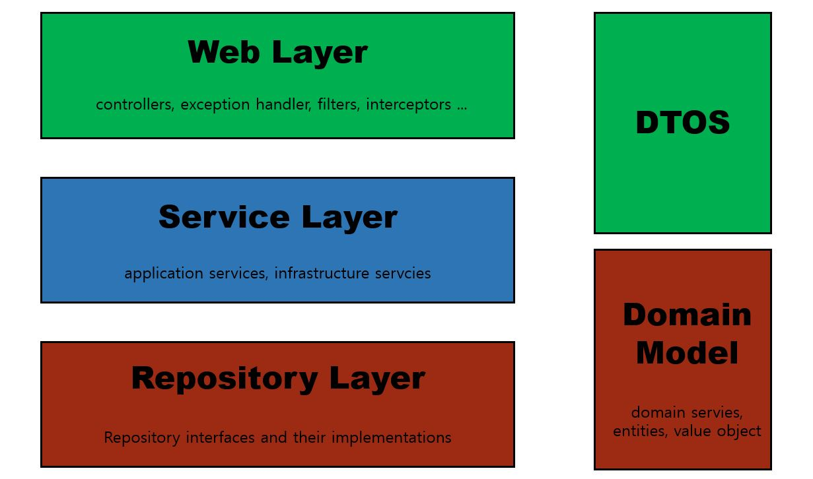

# 스프링 부트와 AWS 로 혼자 구현하는 웹 서비스

- 지은이 : 이동욱
- 출판사 : 프리렉

## ZenHub 사용

> [Chrome ZenHub](https://chrome.google.com/webstore/detail/zenhub-for-github/ogcgkffhplmphkaahpmffcafajaocjbd?hl=ko)

## 자바와 스프링을 사용하는 대기업

- 네이버
- 카카오
- 라인
- 쿠팡
- 배달의민족

## 스프링 부트를 사용하는 이유

스프링을 사용하는 경우 수많은 설정을 해야하는데, 스프링 부트는 그러한 많은 설정들이 자동화되어 비지니스 로직에 집중할 수 있다.
그리고 서버에 톰캣과 같은 웹 애플리케이션 서버를 설치할 필요도 없고 jar 만 있으면 서비스를 운영할 수 있다.

## 개발환경

- JDK 1.8
- Gradle 4.8 ~ 4.10.2

## Gradle Test 코드 동작하게 설정하기


## Annotation Processing 


## JPA vs SQL Mapper

iBatis, MyBatis 는 SQL Mapper 이다. SQL Mapper 는 어떻게 데이터를 저장할지에 초점이 맞춰진 기술이다.

반면, JPA 는 SQL Mapper 를 사용하는 경우 실제로 개발하는 시간보다 SQL 을 다루는 시간이 더 많아지는 것을 해결하기위해 나타난 해결책이며, 객체지향 프로그래밍을 좀 더 효과적으로 지원한다.

> JPA(자바 표준 ORM, Object Relation Mapping) 는 객체를 매핑하는것이고, SQL Mapper 는 쿼리를 매핑하는 것이다.

- 배민, 쿠팡, NHN 등 자사 서비스 개발하는 곳은 `Spring Boot` 와 `JPA` 를 표준으로 사용
- 아직 SI 환경은 `Spring & MyBatis` 또는 `Spring Boot & MyBatis` 사용

- 객체지향 프로그래밍 예제

```java
// 부모가 되는 객체 가져오기
// 누가봐도 User 와 Group 은 부모-자식 관계임을 알 수 있다.
User user = findUser();
Group group = user.getGroup();
```

- SQL Mapper 사용시 문제점(부모-자식 관계를 알 수 없다.)

```java
// 각각 따로 조회
// 상속, 1:N 다양한 객체 모델링을 데이터베이스로 구현할 수 없음
User user = userRepository.findUser();
Group group = groupRepository.findGroup(user.getGroupId));
```

이러한 문제점(데이터 베이스 모델링에만 집중하게 되는 현상)을 해결하기 위해 JPA 가 등장. 서로 지향하는 바가 다른 2개 영역(객체지향 프로그래밍 언어와
관계형 데이터페이스)을 `중간에서 패러다임 일치` 시켜주기 위한 기술.

즉, 개발자는 객체지향 프로그래밍을 하고 JPA 가 이를 관계형 데이터베이스에 맞게 SQL 을 대신 생성해서 실행.

따라서, SQL 에 종속적인 개발을 하지 않아도 된다.

## Spring Data JPA

Spring Data JPA -> Hibernate -> JPA

Hibernate 를 쓰는것과 Spring Data JPA 를 쓰는 것 사이에는 큰 차이가 없지만, 스프링 진영에서는 `Spring Data JPA` 를 쓰는 것을 권장하고 있다.

한단 계 더 감싸놓은 Spring Data JPA 가 등장한 이유는 아래와 같다.

- `구현체 교체의 용이성`
  - Hibernate 외에 다른 구현체로 쉽게 교체하기 위함
- `저장소 교체의 용이성`
  - 관계형 데이터베이스 외에 다른 저장소로 쉽게 교체하기 위함
  - 관계형 DB 를 사용하다가 트래픽이 많아져서 관계형 DB 로 감당이 안되는 경우, 이때 MongoDB 로 교체가 필요한 경우 개발자는 Spring Data JPA 에서 Spring Data MongoDB 로 의존성 교체만 하면 된다.
  
> JPA 의 가장 큰 단점은, 높은 러닝 커브, 하지만 JPA 를 사용함으로써 얻는 이점은 크다. CRUD 쿼리를 직접 작성할 필요가 없다. 또한 부모-자식 관계 표현, 1:N 관계 표현, 상태와 행위를 한 곳에 관리하는 등 객체지향 프로그래밍을 쉽게할 수 있다. JPA 는 여러 성능 이슈 해결책들이 대비된 상태라, 이를 잘 활용하면 네이티브 쿼리 만큼 퍼포먼스가 난다.

## Spring 웹 계층



스프링 MVC 패턴을 사용할 때, 비지니스 로직을 service 계층에서 처리를 했는데, JPA 를 사용하게 되는경우 비지니스 로직 처리를 `도메인` 에서 해야한다.
사실 Service 는 `트랜잭션, 도메인간 순서보장` 역할만 담당한다.

이때 비지니스 처리 로직이 도메인으로 이동하는 이유는, JPA 를 사용하기 전 @Repository 가 붙은 클래스 역할이 @Service 가 붙은 클래스로 이동하기 때문이다. 그럼 기존 Repository 는 JPA 에서 어떻게 변하냐면 아래처럼 `JpaRepository<Entity Class, PK>` 를 상속받아 사용하게끔 변한다.

주의할 점은 Entity Class 와 Entity Repository 는 같은 위치에 존재해야한다.

- domain
  - 모듈명
    - Entity class
    - Entity Repository
 
 혹은
 
 - 모듈명
  - domian
    - Entity class
    - Entity Repository

```java
/**
 * JpaRepository<Entity Class, PK> 를 상속하면 기본적인 CURD 메서드가 자동으로 생성된다.
 * @Repository 추가할 필요 없음
 * 주의 !
 * - Entity 클래스와 Entity Repository 는 함께 위치해야 한다.
 */
public interface PostsRepository extends JpaRepository<Posts, Long> {
}
```

- Web Layer
  - 컨트롤러, 필터, 인터셉터, JSP/Freemarker 등 뷰 템플릿 영역
  - 이외에도 외부 요청과 응답에 대한 전반적인 영역을 담당
- Service Layer
  - @Service 에 사용되는 영역
  - @Transactional 이 사용되어야 하는 영역이기도함
- Repository Layer
  - 데이터베이스와 같이 데이터 저장소에 접근하는 영역
  - DAO 영역
- Dtos
  - DTO(Data Transfer Object) `계층 간에 데이터 교환을 위한 객체` 를 이야기한다.
  - 예를 들어 뷰 템플릿 엔진에서 사용될 객체나 Repository Layer 에서 결과로 넘겨준 객체 등이 이들을 의미
- Domain Model
  - 도메인이라 불리는 개발 대상을 모든 사람이 동일한 관점에서 이해할 수 있고 공유할 수 있도록 단순화시킨 것을 도메인 모델이라 한다.
  - @Entity 가 사용되는 영역
  - 무조건, 데이터베이스 테이블과 관계가 있어야만 하는 것은 아니다.
  - VO 처럼 값 객체들도 이 영역에 해당
 
## H2 데이터 베이스 웹 콘솔로 사용하기

- Application.java 실행 
- http://localhost:8080/h2-console 로 접속


- JDBC URL 에 `jdbc:h2:mem:testdb` 로 작성
- connect 클릭
- 왼쪽 메뉴를 보면 @Entity 가 작성된 클래스 명을 따라 스네이크 기법으로 테이블이 생성되었을 것이다.


### 조회 기능 RestController 의 핸들러 메서드 API 요청

- Chrome JSON Viewer 설치
- http://localhost:8080/api/v1/posts/1 입력

## 서버 템플릿 엔진 vs 클라이언트 템플릿 엔진

> 템플릿 엔진 : 지정된 템플릿 양식과 데이터가 합쳐져 HTML 문서를 출력하는 소프트웨어를 이야기한다. 템플릿 엔진은 화면 역할에만 충실해야 한다.

- 서버 템플릿 엔진
  - JSP, Freemarker 등
  - 서버에서 Java 코드로 문자열을 만든 뒤 이 문자열을 HTML 로 변환하여 브라우저로 전달.
- 클라이언트 템플릿 엔진
  - 리액트, 뷰의 View 파일
  - 브라우저 위에서 작동
  - 서버에서 이미 코드가 벗어난 경우
  - 서버에서는 JSON, XML 형식의 데이터만 전달하고 클라이언트에서 조립한다.
  - 리액트나 뷰 처럼 자바스크립트 프레임워크에서 서버 사이드 랜더링을 지원하기도 한다.

- 자바스크립트에서 JSP 나 Freemarker 처럼 자바 코드 사용할 수 있을 까?

```java
<script type="text/javascript">
$(document).ready(function() {
  if(a == "1") {
    <% Sysyem.out.println("test" %>
  }
});
```

이 코드는 if 문과 관계없이 무조건 test 를 콘솔에 출력한다. 이유는 자바스크립트가 작동하는 영역과 JSP 가 작동하는 영역이 서로 다르다.
JSP 는 명확하게 서버 템플릿 엔진은 아니지만, View 의 역할만 하도록 구성할 떄는 템플릿 엔진으로 사용가능하다.

## 머스테치(Mustache)

수많은 언어를 지원하는 가장 심플한 템플릿 엔진이다.

자바 진영의 템플릿 엔진 JSP, Velocity, Freemarker, Thymeleaf

- JSP, Velocity : 스프링 부트에서 권장하지 않는다.
- Freemarker : 템플릿 엔진으로 너무 과하게 많은 기능 지원. 높은 자유도. 숙련도가 낮으면 Freemarker 안에 비지니스 로직이 추가될 가능성이 있따.
- Thymeleaf : 스프링 진영에서 적극적으로 밀고있는 템플릿. 문법이 어렵고 태그 속성방식을 이용해서 마치 자바스크립트 프레임워크를 배우는 느낌.
- Mustache : 문법이 다른 템플릿 엔진보다 심플. 로직 코드를 사용할 수 없어서 View 와 서버의 역할 명확. Mustache.js 와 Mustache.java 2가지가 다 있어, 하나의 문법으로 클라이언트/서버 템플릿 모두 사용가능

머스테치의 파일 위치는 기본적으로 `src/main/resources/templates` 이다. 머스테치는 스프링 부트 버전을 신경쓰지 않아도 된다. 왜냐하면, 스프링 부트에서 공식 지원하는 템플릿 이기 때문이다.

## 페이지 로딩속도 높이기

css 는 header 에 js 는 footer 에 두는게 좋다. HTML 코드는 위에서 부터 실행되기 때문에 head 가 다 실행되고서야 body 가 실행된다.
즉, header 가 다 불러지지 않으면 사용자 쪽에서는 백지 화면만 노출된다. 특히 js 용량이 크면 body 부분 실행이 늦어지기 때문에 body 하단에 두어
화면이 다 그려진 뒤에 호출하는 것이 좋다.

css 는 화면을 그리는 역할을 하므로 header 에 두는게 좋다.

## 스프링 부트의 파일 경로

스프링 부트는 기본적으로 src/main/resources/static 위치에 자바스크립트, css, 이미지 등 정적 파일 등을 둔다. 따라서 아래와 같이 호출이 가능하다.

- src/main/resources/static/js/ ... (http://도메인/js/...)
- src/main/resources/static/css/ ... (http://도메인/css/...)
- src/main/resources/static/image/ ... (http://도메인/image/...)

## OAuth 로그인 구현

OAuth 로 로그인 구현 시 아래의 것들을 모두 구글, 네이버, 페이스북에 맡기면 되므로 서비스 개발에 집중할 수 있다.

- 로그인 시 보안
- 회원가입 시 이메일 혹은 전화번호 인증
- 비밀번호 찾기
- 비밀번호 변경
- 회원정보 변경

스프링 부트 1.5 에서의 OAuth2 연동 방법이 2.0 에서는 크게 변경되었는데, 인터넷을 뒤져도 설정 방법이 크게 차이가 나지 않은 경우를 볼 수 있다.

이는 `spring-security-oauth2-autoconfigure` 라이브러리 덕분이다. 이 라이브러리를 사용하면 스프링 부트 1.5 에서 사용하던 설정을 2.0 에서도 그대로
사용할 수 있다.

### 스프링 부트 1.5 와 2.0 의 OAuth 설정 차이

> 스프링 부트 2.0은 spring-security-oauth2-autoconfigure 라이브러리 사용

- 스프링 부트 1.5

```yml
google:
  client:
    clientId: 인증정보
    clientSecret: 인증정보
    accessTokenUri: https://accounts.google.com/o/oauth2/token
    userAuthorizationUri: https://accounts.google.com/o/oauth2/auth
    clientAuthenticationScheme: form
    scope: email, profile
  resource:
    userInfoUri: https://www.googleapis.com/oauth2/v2/userinfo
```

- 스프링 부트 2.0

```java
spring:
  security:
    oauth2:
      client:
        clientId: 인증정보
        clientSecret: 인증정보
```        

스프링 부트 1.5 방식에서는 url 주소를 모두 명시해야 하지만, 2.0 방식에서는 client 인증 정보만 입력하면 된다. 1.5 에서 직접 입력했던 값들은
2.0 에서 enum 으로 대체되었다.

`CommonOAuth2Provider` 라는 enum 이 새롭게 추가되어서 구글, 깃허브, 페이스북 등 기본 설정값을 모두 제공한다. 이외에 네이버, 카카오 등을 사용하고 싶으면 따로 추가해야 한다.

- 스프링 부트 2 방식 : Spring Security Oauth2 Client 라이브러리
  - 장점
    - 스프링 팀에서 기존 1.5 에서 사용되던 spring-security-oauth 는 유지상태로 결정했으며, 더는 신규기능이 추가되지 않는다.
    - 스프링 부트용 라이브러리(starter) 출시
    - 기존에 사용되던 방식은 확장 포인트가 적절하게 오픈되어잇찌 ㅇ낳아 직접 상속하거나 오버라이딩 해야 했다.

## 구글 클라우드 플랫폼 서비스 등록하기

> https://console.cloud.google.com 으로 이동


프로젝트 선택 클릭


새 프로젝트 클릭


프로젝트 이름 작성


API 및 서비스 - 대시보드 이동


사용자 인증정보 - 동의 화면 구성 클릭


애플리케이션 이름(구글 로그인 시 사용자에게 노출될 애플리케이션 이름), 이메일 작성(사용자 동의 화면에서 노출될 이메일 주소, 보통은 서비스의 help 이메일 주소 작성)

`email, profile, openid` 는 Google API 의 범위를 의미한다. 이번에 등록할 구글 서비스에서 사용할 범위를 의미한다.


OAuth 클라이언트 ID 만들기 선택


빨간색 칸 작성

- 승인된 리디렉션 URI
  - 서비스에서 파라미터로 인증 정보를 주었을 때 인증이 성공하면 구글에서 리다이렉트 할 URL
  - 스프링 부트 2 버전의 시큐리티에서는 기본적으로 `도메인/login/oauth2/code/소셜서비스코드` 로 리다이렉트 할 URL 를 지원하고있다.
  - 사용자가 별도로 리다이렉트 URL 을 지원하는 Controller 를 만들 필요가 없다. 시큐리티에서 이미 구현해 놓은 상태
  - AWS 서버에 배포하게 되면 localhost 외에 추가로 주소를 추가해야한다.

## 세션 저장소로 데이터베이스 사용하기

책 200p 기준으로, 우리가 만든 서비스는 애플리케이션을 재실행하면 로그인이 풀린다. 그 이유는 세션이 `내장 톰캣의 메모리에 저장`되기 때문이다.

기본적으로 세션은 `WAS(Web Application Server)` 의 메모리에서 저장되고 호출된다. 메모리에 저장되다 보니 내장 톰캣처럼 애플리케이션 실행 시
실행 되는 구조에선 항상 초기화가 된다.

즉, 배포할 때마다 톰캣이 재시작 되는 것이다.

한 가지 더 문제는, 2대 이상의 서버에서 서비스하고 있다면, `톰캣마다 세션 동기화 설정`을 해야 한다.

실제 현업에서는 세션 저장소에 대해 아래 3가지 중 하나를 선택한다.

- `톰캣 세션을 사용한다.`
  - 일반적으로 별다른 설정을 하지 않을 때 기본적으로 선택되는 방식
  - 이렇게 될 경우 톰캣(WAS) 에 세션이 저장되기 때문에 2대 이상의 WAS 가 구동되는 환경에서는 톰캣들 간의 세션 공유를 위한 추가 설정이 필요하다.
- `MySQL 과 같은 데이터베이스를 세션 저장소로 사용한다.`
  - 여러 WAS 간의 공용 세션을 사용할 수 있는 가장 쉬운 방법
  - 많은 설정이 필요 없지만, 결국 로그인 요청마다 DB IO 가 발생하여, 성능 이슈가 발생할 수 있다.
  - 보통 로그인 요청이 많이 없는 백오피스, 사내 시스템 용도에 적합
- `Redis, Memcached` 와 같은 메모리 DB 를 세션 저장소로 사용한다.`
  - B2C 서비스에서 가장 많이 사용하는 방식
  - 실제 서비스로 사용하기 위해서는 Embedded Redis 와 같은 방식이 아닌 외부 메모리 서버가 필요하다.

## 네이버 로그인

> [네이버 오픈 API](https://developers.naver.com/apps/#/wizard/register)

- 
- 

## test application.properties

test 에 application.properties 가 없으면 main 의 설정을 그대로 가져온다. 단 추가로 생성한 application-oauth.properties 같은 파일들은 
가져오지 못하기 때문에 테스트 환경을 위한 application.properties 파일을 만들어야 한다.

## 24시간 작동하는 서버 만들기 (서버 배포)

외부에서 본인이 만든 서비스에 접근하려면 24시간 작동하는 서버가 필수이다. 방법은 3가지 이다.

- 집에서 PC 를 24시간 구동시킨다.
- 호스팅 서비스(Cafe24, 코리아 호스팅 등)을 이용한다.
- 클라우드 서비스(AWS, AZURE, GCP 등)을 이용한다.

일반적으로 비용은 호스팅 서비스나 집 PC 를 이용하는것이 저렴하다. 만약 특정 시간에만 트래픽이 몰린다면 `유동적으로 사양을 늘릴 수 있는 클라우드`
가 유리하다.

### 클라우드 서비스란?

인터넷(클라우드)을 통해 서버, 스토리지, 데이터베이스, 네트워크, 소프트웨어, 모니터링 등 컴퓨팅 서비스를 제공하는 것을 말한다.

### 클라우드 형태

- Infrastructure as a Service(IaaS, 아이아스, 이에스)
  - 기존 물리 장비를 미들웨어와 함께 묶어둔 추상화 서비스이다.
  - 가상머신, 스토리지, 네트워크, 운영체제 등의 IT 인프라를 대여해 주는 서비스라고 보면 된다.
  - AWS 의 EC2, S3 등
  
- Platform as a Service(PaaS, 파스)
  - 앞에서 언급한 IaaS 에서 한 번 더 추상화한 서비스이다.
  - 한 번 더 추상화했기 떄문에 많은 기능이 자동화되어있다.
  - AWS 의 Beanstalk(빈스톡), Heroku(헤로쿠) 등
  
- Software as a Service(SaaS, 사스)
  - 소프트웨어 서비스를 이야기한다.
  - 구글 드라이브, 드랍박스, 와탭 등
